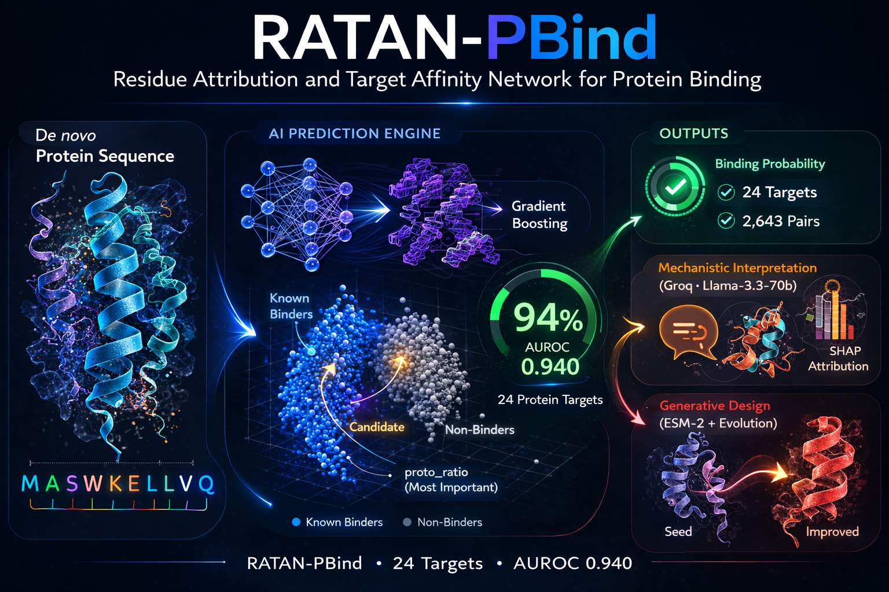

# RATAN-PBind

**Residue Attribution and Target Affinity Network for Protein Binding**

A multi-target protein binding predictor trained on 2,643 experimentally validated protein–target pairs across 24 human and viral targets from the [Proteinbase dataset](https://proteinbase.com) (Adaptyv Bio, ODC-BY licence).



---

## Key Results

| Model | AUROC | AUPRC | F1 | MCC |
|-------|-------|-------|----|-----|
| LightGBM + Proto (final) | **0.940** | **0.765** | 0.748 | 0.698 |
| LightGBM baseline | 0.893 | 0.713 | 0.678 | 0.625 |

- **509 features**: amino acid composition, dipeptide composition, physicochemical properties, ESMFold/ProteinMPNN scores, Boltz2 structural metrics, design method encoding, and 7 novel prototype similarity features
- **proto_ratio** is the top SHAP feature — 2.2× more important than the next feature
- Multi-seed stability: AUROC = 0.9395 ± 0.0054 (10 random seeds)
- Well-calibrated: ECE = 0.042

---

## Features

- **Binding prediction** — probability score + confidence for 24 human/viral targets
- **SHAP interpretability** — residue-level feature attribution
- **LLM integration** — Groq/Llama-3.3-70b translates SHAP into mechanistic molecular explanations
- **Mutation advisor** — point mutation scanning with biochemical rationale
- **Generative design** — directed evolution + ESM-2 MLM redesign engine
- **Interactive web app** — 6-tab Gradio interface

---

## Installation

```bash
git clone https://github.com/kartic03/RATAN-PBind.git
cd RATAN-PBind
pip install -r requirements.txt
```

### Optional: Groq AI integration
Create a `.env` file:
```
GROQ_API_KEY=your_groq_api_key_here
GROQ_MODEL=llama-3.3-70b-versatile
```
Get a free API key at [console.groq.com](https://console.groq.com).

---

## Usage

### Web app
```bash
python3 app.py
# Open http://localhost:7860
```

### Python API
```python
from protbind import ProtBind

pb = ProtBind()

# Single prediction
result = pb.predict("MASWKELLVQNKNQFNLERSELTNGFLKPIVKVVKKLPEEVLAERIRKAFG",
                    target="nipah-glycoprotein-g")
print(f"Binding probability: {result['probability']:.1%}")

# SHAP explanation
explanation = pb.explain(result, top_n=10)

# Mutation scan
mutations = pb.suggest_mutations(sequence, target="egfr", top_n=10)

# Batch prediction
df = pb.batch_predict(sequences_list, target="egfr")
```

### Generative design
```python
from protbind.designer import ProtBindDesigner

designer = ProtBindDesigner(pb)
result = designer.design(
    target="nipah-glycoprotein-g",
    seed_sequence="MASWKELLVQ...",
    mode="combined"   # evolution + ESM-2 MLM refinement
)
```

---

## Supported Targets (24)

`egfr` · `nipah-glycoprotein-g` · `pd-l1` · `mdm2` · `il7r` · `spcas9` · `human-insulin-receptor` · `human-pdgfr-beta` · `human-mzb1-perp1` · `ifnar2` · `fgf-r1` · `fcrn` · `der21` · `der7` · `human-ambp` · `human-idi2` · `human-rfk` · `hnmt` · `human-pmvk` · `human-phyh` · `human-serum-albumin` · `human-tnfa` · `human-orm2` · `human-gm2a`

---

## Repository Structure

```
RATAN-PBind/
├── app.py                  # Gradio web application (6 tabs)
├── protbind/               # Python package
│   ├── __init__.py         # ProtBind class + KNOWN_TARGETS
│   ├── predictor.py        # predict(), explain(), suggest_mutations()
│   ├── features.py         # Feature extraction pipeline
│   ├── ai_explain.py       # Groq LLM integration
│   └── designer.py         # Generative design engine
├── src/                    # Training scripts (phases 1–8)
├── models/                 # Pre-trained model weights
├── features/               # Pre-computed feature matrices
├── data/                   # Train/val/test splits
└── outputs/                # Result CSVs and plots
```

---

## Data

Training data from **Proteinbase** by Adaptyv Bio (ODC-BY licence).
The raw dataset is not included in this repository. Download from:
https://storage.proteinbase.com/proteinbase_all_data_28_01_2026.csv

> *This work used Proteinbase by Adaptyv Bio under ODC-BY licence.*

---

## Citation

> Kartic. RATAN-PBind: Residue Attribution and Target Affinity Network for Protein Binding.
> GitHub: https://github.com/kartic03/RATAN-PBind

---

## Author

**Kartic**
Department of Life Sciences, Gachon University
Seongnam, Gyeonggido 13120, Republic of Korea

---

## Licence

MIT — see [LICENSE](LICENSE) for details.
Training data: ODC-BY (Proteinbase, Adaptyv Bio).
