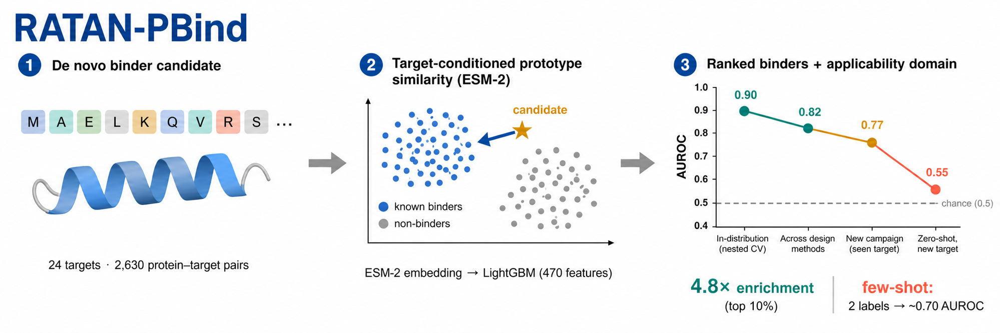

# RATAN-PBind

**Retrieval-Augmented, Target-Aware Nomination for Protein Binding** - sequence-based prioritisation of de novo binders, with a characterised applicability domain and few-shot extension to new targets.

A machine-learning pre-screen for de novo binder campaigns, trained on 2,630 experimentally labelled protein–target pairs across 24 human and viral targets from the [Proteinbase dataset](https://proteinbase.com) (Adaptyv Bio, ODC-BY licence). It ranks candidate binders cheaply from sequence and reports *where its predictions can and cannot be trusted*.



## What it does

De novo binder design produces thousands of candidates per campaign, but fewer than one in five binds. RATAN-PBind ranks candidates from sequence using a target-conditioned **prototype-similarity** feature (how closely a candidate resembles a target's known binders vs non-binders in ESM-2 embedding space) on top of composition, physicochemical, design-method, and structural features.

The contribution is an honest, quantified **applicability domain** rather than a single headline number: we show across four generalisation axes exactly where the model works.

## Key results

| Evaluation | AUROC |
|---|---|
| In-distribution, held-out test | **0.946** (95% CI 0.919–0.968) |
| In-distribution, nested cross-validation (leakage-free) | **0.895 ± 0.006** |
| Across design methods (leave-method/author-out) | 0.73–0.82 |
| Zero-shot to a novel target (LOTO) | 0.54–0.57 |
| Independent dataset (after de-duplication) | ~0.49 |

- **470 features** (463 base + 7 prototype-similarity). `proto_ratio` is the top SHAP feature.
- **Practical utility:** top-10% ranking enriches binders **4.8×** over the 17.8% base rate.
- **Few-shot:** adding ~2 known binders of a new target recovers AUROC from chance to **~0.70**.
- **Validated:** label-shuffle control, sequence- and batch-level leakage audits, nearest-neighbour and single-feature baselines, external (Overath 2025) and natural-PPI (SKEMPI 2.0) checks, and independent structural validation (Boltz-2 ipTM, MM-GBSA).
- The model is a **binder/non-binder classifier** and does not rank affinity.

## Installation

```bash
git clone https://github.com/kartic03/RATAN-PBind.git
cd RATAN-PBind
pip install -r requirements.txt
```

For a fully reproducible environment, use the pixi lockfile (`pixi.toml` / `pixi.lock`):

```bash
pixi run -e ml python src/r3_robust_eval.py   # CPU analysis
pixi run -e gpu python src/r1_embed_targets.py # ESM-2 embeddings (CUDA)
```

### Optional: Groq LLM interpretation
Create a `.env` file with `GROQ_API_KEY=...` (free key at [console.groq.com](https://console.groq.com)). The LLM module is a faithfulness-bounded convenience (~87% grounded in the SHAP evidence), not a mechanistic claim.

## Usage

### Web app
```bash
python3 app.py    # open http://localhost:7860
```

### Python API
```python
from protbind import ProtBind
pb = ProtBind()
result = pb.predict("MASWKELLVQNKNQFNLERSELTNGFLKPIVKVVKKLPEEVLAERIRKAFG",
                    target="nipah-glycoprotein-g")
print(f"Binding probability: {result['probability']:.1%}")
explanation = pb.explain(result, top_n=10)
mutations   = pb.suggest_mutations(sequence, target="egfr", top_n=10)
```

Targets with few known binders fall in the few-shot regime — interpret scores accordingly and calibrate on a first experimental batch.

## Reproducing the analysis

All experiments are scripted under `src/` and regenerate from the released artefacts:

- `src/r1_*` target-aware modelling / leave-one-target-out
- `src/r3_robust_eval.py` bootstrap CIs, per-target reliability, shared-vs-single
- `src/r8_*`, `src/r8b_*` significance, leakage audits, few-shot, baselines, calibration, external/SKEMPI/MM-GBSA
- `src/r7_figures_final.py` the manuscript figure set

The headline model (`models/lgb_proto.pkl`), the feature matrix, feature columns, and the train/val/test splits are in the repo (`models/`, `features/`, `data/`). The large artefacts — the ESM-2 embeddings and the heavier baseline models (random forest, SVM, fine-tuned ESM-2) — are archived on Zenodo ([10.5281/zenodo.20656437](https://doi.org/10.5281/zenodo.20656437)) to keep the repo lightweight; they are also regenerable from `src/`. Each analysis script in `src/` writes its results to `outputs/` as CSV/JSON, so every reported number is regenerable.

## Supported targets (24)

`egfr` · `nipah-glycoprotein-g` · `pd-l1` · `mdm2` · `il7r` · `spcas9` · `human-insulin-receptor` · `human-pdgfr-beta` · `human-mzb1-perp1` · `ifnar2` · `fgf-r1` · `fcrn` · `der21` · `der7` · `human-ambp` · `human-idi2` · `human-rfk` · `hnmt` · `human-pmvk` · `human-phyh` · `human-serum-albumin` · `human-tnfa` · `human-orm2` · `human-gm2a`

## Data

Training data from **Proteinbase** by Adaptyv Bio (ODC-BY licence). The raw dataset is not redistributed here; download from https://storage.proteinbase.com/proteinbase_all_data_28_01_2026.csv

> *This work used Proteinbase by Adaptyv Bio under the ODC-BY licence.*

## Citation

> Kartic, Choi J, Park T-S. RATAN-PBind: Retrieval-Augmented, Target-Aware Nomination of de novo protein binders within a characterised applicability domain.
> Code: https://github.com/kartic03/RATAN-PBind

## Authors

Kartic and Jiwon Choi (equal contribution); Tae-Sik Park (corresponding).
Department of Life Sciences, Gachon University, Seongnam, Republic of Korea.

## Licence

MIT — see [LICENSE](LICENSE). Training data: ODC-BY (Proteinbase, Adaptyv Bio).
